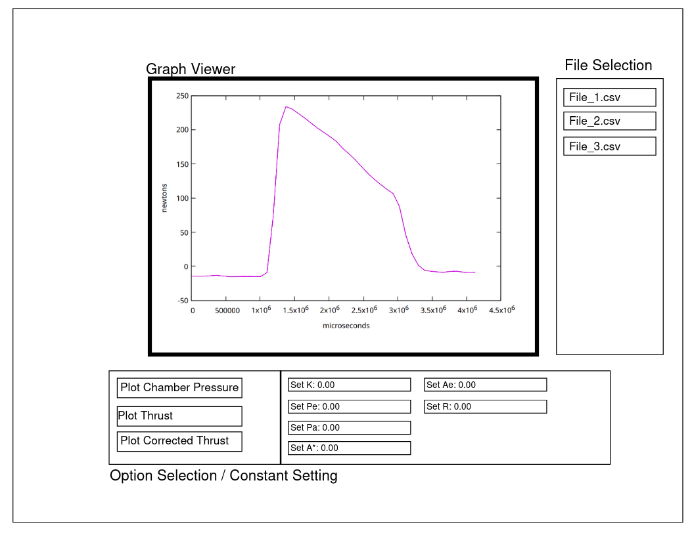

# Final Project CS408

## Information On Using the Website

There are a couple of files you can use in the repository
for uploading and trying out the system with. They are
``launch_2.json`` and ``sample_file.txt``. The file
``launch_2_filled.json`` has had the correct parameters
set for the analysis and the full graph generated for it,
so you can look at that for an idea of what the parameters
need to be set to. I will admit that I don't understand what
most of the values mean, I just manipulated the equations to
get the values that I was asked to find and then made sure
that the people who did have context for the numbers thought
that the output was correct :).    
    
If you want a demo of the value calculation, go to graphing
and select ``launch_2_filled_bak.json``. This file has
everything ready. Then press Find Values and wait. The program
should update after a few seconds with the corrected thrust
and pressure of exhaust showing as well.    
   
The same values for all parameters will work for the launch_3.json
file in the repository. If you paste them in and then select
the appropriate start and end points for the motor burn time,
the find values call should work for it as well.

## Features

### Index

This is just meant to be a landing page and doesn't
have a ton of functionality other than as a passthrough
for the other pages. All the other pages have form 
submisson and various other features though, so I should
be good in terms of that requirement. I just didn't think
it worked organizationally to have any logic on the main
page :/.

### File Management

This page allows files to be uploaded to the database, images
of the data in files to be generated, and downloading or
deleting of both data and image files.

### Graphing

This page will display the graphs of files that have been 
uploaded to the system and allows users to run a program
to find a correct thrust curve and the values for velocity
and temperature of exhaust, total impulse, mass flow rate,
and pressure of exhaust for the data in the file. To do
this, several values will need to be entered by the user,
including various pressures and characteristics of the 
motor being used. The set values button updates the state,
save configuration will update the state and send it to
the server, and find values will run the algorithm that computes
the unknown information. This takes a bit and will produce garbage
if you don't have things set right.

### Viewing

I figured it would be good to have a way to view images before
downloading them to ensure that you got the right one. This
page does that. In case a ton of images end up getting produced,
you can prefix filter the images by entering the prefix of the
image file you are looing for, followed by pressing the filter
button. This will only display images with a matching prefix.
Selecting an image causes it to display the image, not a chart
object! That way users will have an idea of what they would be
downloading.

# Old stuff from project specification

## General Theme

I have been hanging out with the guys on the rocketry club lately, and have had the 
opportunity to produce a fair amount of data collection and processing code for
them. They are producing their own rocket motors this year, and need to backsolve
much of the properties from collected thrust data during test launches, so I have
been working on the calculations to do this.     
    
The current work is contained in this organization:
```
https://github.com/bsurocketry
```
and is mostly C code. It makes sense to leave the data collection stuff in
this form, however the data processing code would probably be much better
off in some kind of hosted web UI. I have been dumping the processed values
to CSV files and using gnuplot, but I keep getting asked to render different
stuff or do different things. The hope would be to throw this in a web API
where the output files can be uploaded and results can be processed. Then
data would be provided via some kind of graph that could be interacted with.

## What it is going to do

The [data collection software](https://github.com/bsurocketry/motor_stand) operates 
during the rocket launch test and collects readings of the rocket thrust. These
values are output to a CSV file along with a timestamp for the launch duration.
The information contained in this CSV file is somewhat useful but really needs
to be transformed into a bunch of other useful stuff.    
    
These webpages:
```
https://www.nakka-rocketry.net/th_thrst.html
https://www.nakka-rocketry.net/th_pres.html
```

Contain the equations nessesary for collecting
the chamber pressure, mass flow rate, velocity
of exhaust, chamber temperature, and burn rate
of the motor from the thrust values collected. 
These of course need to be brought into a form that allows for optimization. I
have already gone through and done much of this work, it is contained in the
following file:
```
https://github.com/bsurocketry/data_processing/blob/main/src/minimize_brute_force.c
```

The goal for this project will be to basically port all of this work to a
web app that also enables live plotting of the data and editing of the
configurable parameters. If you look in the current code you will see that
many of the values used for the equations are just hard coded, and we have
been working for now by just recompiling when things change which is not
ideal as I was the only one who knows how to compile this code. Being able
to set these and the view the result would be very helpful for iterating
and viewing results. It also enables more people to use the work.    
    
People should be able to upload data files, view the raw graph, set the
known values and the start and end of the data capture, and then perform
the various value calculations and see the results in the graph. Having the
graph be modifiable to only display certain things or zoom in would be good
as well.


## Target Audience 

The target audience would be the members of the Boise State rocketry team. They would need the data
to figure out whether their rocket is working correctly and iterate on their design. Having this be
in a more interactive and user friendly form would be very helpful to them as they do not like 
having to ask me for different graphs and such.

## Data Managed

The data this program is managing will be in the form of CSV files. These will
be uploaded by the users, will be generated by the program, and will be avaliable
for download by the users as well. 

## Stretch Goals 

Being able to download an image of whatever graphs are produced, and
having a method for auto-determining the pre and post steady state
times instead of having them be done manually would be nice for use.   
    
Adding more to the graph interaction would also probably be nice.

## Outline

### Graphs

Here are some of the graphs to get an idea of what they look like.
I would want some kind of gnuplot or other plotting library integration.


### Layout

Layout design... There will actually be CSS in the real one.



I plan to use the other pages for file upload and management, ie.
uploading downloading and deleting files from the system. The main
page will just be a directory to the other two :).

## Sources Used
 * https://www.chartjs.org/
 * https://stackoverflow.com/questions/20206038/converting-chart-js-canvas-chart-to-image-using-todataurl-results-in-blank-im
 * https://medium.com/@anjanava.biswas/nodejs-runtime-environment-with-aws-lambda-layers-f3914613e20e
 * https://docs.aws.amazon.com/AWSJavaScriptSDK/v3/latest/client/dynamodb/command/ScanCommand/
 * https://stackoverflow.com/questions/28109150/check-if-user-input-is-an-integer-javascript
 * https://stackoverflow.com/questions/2794137/sanitizing-user-input-before-adding-it-to-the-dom-in-javascript
 * https://www.geeksforgeeks.org/javascript/how-to-convert-base64-to-file-in-javascript/
 * https://www.geeksforgeeks.org/javascript/how-to-trigger-a-file-download-when-clicking-an-html-button-or-javascript/
 * https://www.geeksforgeeks.org/html/how-to-upload-files-in-javascript/
 * https://stackoverflow.com/questions/44240726/chartjs-using-multiple-y-axes
